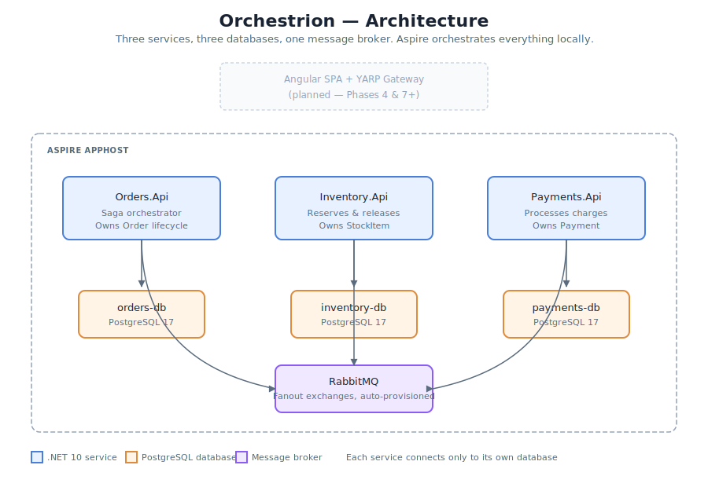
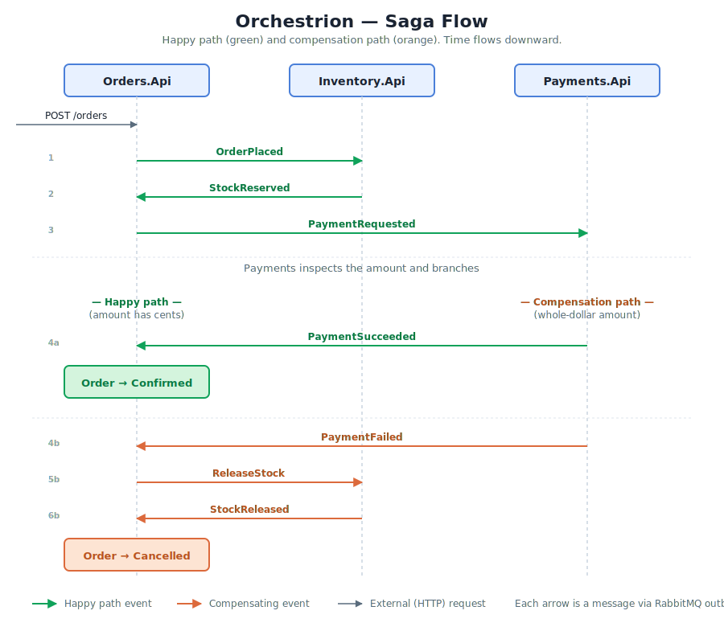

# Orchestrion

> An event-driven microservices order processing system built with .NET 10, Aspire, Wolverine, and RabbitMQ — demonstrating the saga, outbox, and compensation patterns with per-service PostgreSQL and end-to-end OpenTelemetry tracing.

---

## What this is

Orchestrion is a working distributed system that processes e-commerce orders across three independent services (Orders, Inventory, Payments) coordinated through asynchronous messaging. When a customer places an order, a **saga** orchestrates the flow: reserve stock, charge the card, confirm the order on success — or **compensate** by releasing the reservation and cancelling the order on failure.

The project demonstrates patterns and tradeoffs that real distributed systems live with: database-per-service, the transactional outbox, exactly-once message processing via the inbox, and saga-based compensation as an alternative to distributed transactions.

> **Note on naming:** the codebase uses the working name OrderFlow (visible in solution files, namespaces, and project names). Orchestrion is the project public identity. The name evolved during the build.

---

## Architecture

Three .NET 10 services, each owning its own PostgreSQL database, communicating exclusively through RabbitMQ. Aspire orchestrates the whole system locally — every service, every container, every connection string — from a single dashboard.

- Orders.Api — accepts orders, hosts the saga, owns the order lifecycle
- Inventory.Api — owns stock levels, handles reservations and releases
- Payments.Api — processes payment requests, records outcomes
- PostgreSQL x3 — orders-db, inventory-db, payments-db (strict per-service isolation)
- RabbitMQ — message broker with fanout exchanges per event type
- Aspire AppHost — orchestration, configuration, OpenTelemetry collection

---

## The saga

Happy path (4 seconds end-to-end): POST /orders triggers OrderPlaced, Inventory reserves stock and publishes StockReserved, Orders publishes PaymentRequested, Payments charges and publishes PaymentSucceeded, Orders marks the order Confirmed.

Compensation path (when payment fails): Payments publishes PaymentFailed, Orders publishes ReleaseStock, Inventory reverses the reservation and publishes StockReleased, Orders marks the order Cancelled.

The order status is the saga state: Pending becomes Confirmed or Cancelled. The compensation is a semantic undo (subtract reserved, add available) — not a database rollback. This is the senior-flavored insight of the project: distributed consistency through compensating events, not through locks or distributed transactions.

---

## Tech stack

- Runtime: .NET 10 (current LTS)
- Orchestration: .NET Aspire 13
- Messaging: Wolverine 6 with RabbitMQ transport and Postgres outbox
- Broker: RabbitMQ 4.2
- Persistence: PostgreSQL 17 with EF Core 10
- Observability: OpenTelemetry via Aspire ServiceDefaults
- Tests: xUnit + Testcontainers (planned)

---

## Patterns demonstrated

- Database-per-service: each service owns its own PostgreSQL database, never shared. Service boundaries enforced through data ownership.
- Transactional outbox: messages are written into wolverine_outgoing_envelopes in the same transaction as the business data. Atomic commit means no lost events on crash.
- Transactional inbox: incoming message IDs are recorded for deduplication, giving exactly-once processing semantics on top of RabbitMQ at-least-once delivery.
- Saga (orchestration flavor): Orders.Api is the central coordinator. Each event triggers a handler that decides what to publish next.
- Compensation: the failure path uses compensating events (ReleaseStock, StockReleased) to undo committed work, rather than attempting distributed rollback.
- Idempotent handlers: every saga handler checks the aggregate state before transitioning, making it safe against duplicate deliveries.
- Single-writer-per-aggregate: only Orders.Api ever mutates an Order; only Inventory.Api ever mutates a StockItem. Other services request changes via messages.

---

## How to run locally

Prerequisites: .NET 10 SDK, Docker (OrbStack recommended on macOS), Aspire CLI.

Install the Aspire CLI:

    curl -sSL https://aspire.dev/install.sh | bash

Clone and run:

    git clone https://github.com/SharonSilva/orderflow.git
    cd orderflow
    aspire run

Aspire pulls container images, spins up RabbitMQ + PostgreSQL + Redis + pgAdmin, launches the three services, and opens the dashboard.

Trigger the happy path:

    curl -k -X POST https://localhost:7548/orders \
      -H "Content-Type: application/json" \
      -d "{\"customerId\":\"cust-1\",\"productId\":\"prod-1\",\"quantity\":2,\"amount\":29.99}"

Wait 3 seconds, then check the order with GET https://localhost:7548/orders. The order should show status 1 (Confirmed).

Trigger the compensation path (whole-dollar amounts deterministically fail):

    curl -k -X POST https://localhost:7548/orders \
      -H "Content-Type: application/json" \
      -d "{\"customerId\":\"cust-fail\",\"productId\":\"prod-1\",\"quantity\":2,\"amount\":50.00}"

Wait 5 seconds. The order ends up status 2 (Cancelled), and the stock returns to its pre-order state.

---

## Design decisions

Orchestration over choreography. The saga lives in Orders.Api — one service decides what to publish next based on incoming events. Orchestration is easier to reason about and easier to trace.

Wolverine over MassTransit. MassTransit v9 introduced a commercial license in 2025. Wolverine stayed MIT-licensed with a modern handler model and built-in outbox.

Deterministic payment failure. Payments simulates a charge: amounts ending in .00 fail, everything else succeeds. This gives a knob to demonstrate both saga paths without integrating Stripe.

Database-per-service over a shared database. Strict isolation. No service can JOIN across another data.

EnsureCreated for dev migrations. Production would use proper EF Core migrations.

---

## Known limitations

Honest scoping — things deliberately left out:

- No integration tests yet (planned with xUnit + Testcontainers).
- No gateway in the request path (YARP planned).
- No frontend (Angular SPA with SignalR is the planned next phase).
- Distributed traces do not span services in the dashboard.
- Payments is a stub.
- No authentication.

---

## Acknowledgements

Built as a portfolio piece to learn and demonstrate distributed systems patterns in the .NET ecosystem. Wolverine outbox and saga support, plus Aspire local orchestration, did the heavy lifting.
